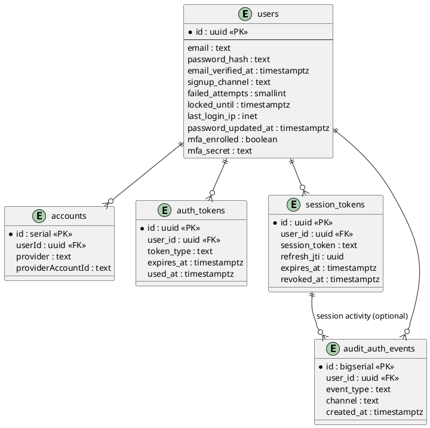

# 자체 이메일·비밀번호 인증 확장안

## 0. 범위와 전제
- 현재 Next.js 대시보드(NextAuth + Google/Kakao/Naver OAuth)와 FastAPI 백엔드를 그대로 유지하면서, 이메일·비밀번호 기반 Credential Provider를 추가해도 토큰 스키마(`plan`, `role`, `sub`)가 변하지 않도록 설계한다.
- FastAPI는 단일 진실 소스로 계정 상태(검증, 잠금, 비밀번호 해시)를 관리하고, Next.js Auth.js는 Credential Provider를 통해 FastAPI `/auth/login`을 호출해 JWT를 수신한다. 소셜 로그인은 기존 `accounts` 테이블을 유지한다.
- Argon2id 기반 해시, 단일 사용 토큰, 감사 로그, 레이트 리밋 정책을 데이터 모델·API 단계에서 함께 고려한다.

## 1. 데이터 모델 & 스토리지

### 1.1 ERD 개요
```
[users]
  ├─< accounts          (OAuth 프로바이더 계정, 기존 유지)
  ├─< auth_tokens       (이메일 검증/비밀번호 재설정/이메일 변경 토큰)
  ├─1 user_passwords    (선택: 패스워드 버전 관리가 필요할 때)
  └─< audit_auth_events (가입/로그인/잠금 등 감사 로그)
```
> `user_passwords`는 향후 패스워드 히스토리 정책이 필요할 때를 대비한 선택 사항이며, 초기에는 `users.password_hash` 하나만으로도 충분하다.

### 1.2 `users` ??? ?? (?? ???)

#### 1.2.1 ?? ????
| ?? | ?? | ??? | ??/??? | ?? |
| --- | --- | --- | --- | --- |
| `email` | `TEXT` (`CITEXT` ??) | - | `UNIQUE (lower(email))` | ?? NextAuth ??. ???? ?? ?? ??? ??. |
| `password_hash` | `TEXT` | `NULL` | Argon2id ?? ?? CHECK(??) | `$argon2id$v=19$m=131072,t=4,p=1$...`. NULL?? OAuth-only. |
| `email_verified_at` | `TIMESTAMPTZ` | `NULL` | ??? `idx_users_email_verified` | ?? ?? ??. |
| `signup_channel` | `TEXT` | `'email'` | CHECK (`IN ('email','google','kakao','naver','admin_invite')`) | ?? ?? ??. ?? ? ?? ?? ? ?? ??? ???? ?? ??? ?? ??? ???. |
| `failed_attempts` | `SMALLINT` | `0` | CHECK (`failed_attempts >= 0`) | ?? ?? ??. |
| `locked_until` | `TIMESTAMPTZ` | `NULL` | ?? ??? `idx_users_locked_until` | ?? ?? ?? ??. |
| `last_login_ip` | `INET` | `NULL` | - | ?? ?? ??? IP (IPv4/6). |
| `password_updated_at` | `TIMESTAMPTZ` | `NULL` | - | ???? ??/??? ??. |
| `mfa_enrolled` | `BOOLEAN` | `FALSE` | - | MFA ???. ?? TOTP/Passkey ??. |
| `mfa_secret` (??) | `BYTEA` | `NULL` | ???/?? ???? | TOTP ???. ??? KMS/Lockbox ??? ??. |

> `mfa_secret`? ???? `mfa_enrolled` ?? TRUE ?? ??? CHECK (`CHECK (mfa_secret IS NULL OR mfa_enrolled IS TRUE)`)? ??? ? ??.

#### 1.2.2 DDL ??
```sql
ALTER TABLE "users"
    ADD COLUMN IF NOT EXISTS password_hash TEXT,
    ADD COLUMN IF NOT EXISTS email_verified_at TIMESTAMPTZ,
    ADD COLUMN IF NOT EXISTS signup_channel TEXT NOT NULL DEFAULT 'email'
        CHECK (signup_channel IN ('email','google','kakao','naver','admin_invite')),
    ADD COLUMN IF NOT EXISTS failed_attempts SMALLINT NOT NULL DEFAULT 0 CHECK (failed_attempts >= 0),
    ADD COLUMN IF NOT EXISTS locked_until TIMESTAMPTZ,
    ADD COLUMN IF NOT EXISTS last_login_ip INET,
    ADD COLUMN IF NOT EXISTS password_updated_at TIMESTAMPTZ,
    ADD COLUMN IF NOT EXISTS mfa_enrolled BOOLEAN NOT NULL DEFAULT FALSE,
    ADD COLUMN IF NOT EXISTS mfa_secret BYTEA,
    ADD CONSTRAINT chk_mfa_consistency CHECK (mfa_secret IS NULL OR mfa_enrolled IS TRUE);

CREATE UNIQUE INDEX IF NOT EXISTS users_email_lower_key
    ON "users" (LOWER(email));
CREATE INDEX IF NOT EXISTS idx_users_email_verified
    ON "users" ((email_verified_at IS NOT NULL));
CREATE INDEX IF NOT EXISTS idx_users_locked_until
    ON "users" (locked_until) WHERE locked_until IS NOT NULL;
```

#### 1.2.3 ?? ??
- **???**: `signup_channel='email'`? ???? ?? ?? ? ?? provider? ????.
- **?????? ??**: ?? `emailVerified` ? `email_verified_at`?? ??? ?? ? ?? deprecated.
- **???**: `password_hash` ?? ?? ??(`mfa_secret`)? KMS envelope encryption ?? Hashicorp Vault transit API ?? ??.

### 1.3 `auth_tokens` ???

#### 1.3.1 ?? ????
| ?? | ?? | ??? | ?? | ?? |
| --- | --- | --- | --- | --- |
| `id` | `UUID` | `gen_random_uuid()` | PK | ??? ???. |
| `user_id` | `UUID` | - | FK ? `users(id)` ON DELETE CASCADE | ?? ???. |
| `token` | `TEXT` | - | UNIQUE, ?? CHECK (= 43) | url-safe base64 32???. ?? ? ?? ??. |
| `token_hash` (??) | `TEXT` | - | UNIQUE | ?? ?? Argon2/bcrypt ?? ?? ? ??. |
| `token_type` | `TEXT` | - | CHECK (`IN ('email_verify','password_reset','email_change')`) | ?? ??. |
| `identifier` | `TEXT` | - | - | ??? ??/?? ?? ?. |
| `expires_at` | `TIMESTAMPTZ` | - | CHECK (`expires_at > created_at`) | ?? ?? (?? 30?~24??). |
| `used_at` | `TIMESTAMPTZ` | `NULL` | - | 1? ?? ? ????? ??. |
| `metadata` | `JSONB` | `'{}'::jsonb` | - | ????? IP, UA, redirect URI ?. |
| `created_at` | `TIMESTAMPTZ` | `NOW()` | - | ?? ??. |

> `token` ?? `token_hash` ? ??? ????? `CHECK (token IS NOT NULL OR token_hash IS NOT NULL)`? ???? BYOK ??? ???? ??? ? ??.

#### 1.3.2 ??/?? ?? ??
- ?? ?? ? TTL: ??? ?? 24h, ???? ??? 30m(?? ???? 60m??), ??? ?? 24h.
- ? ?? ? `used_at` ?? ? `token`/`token_hash` ??(?? NULL) ? ?? ?? ??? ??.
- Quartz/Beat job? `expires_at < now()` ?? `used_at IS NOT NULL AND used_at < now()-7d` ???? ????? ??.

#### 1.3.3 DDL ??
```sql
CREATE TABLE IF NOT EXISTS auth_tokens (
    id UUID PRIMARY KEY DEFAULT gen_random_uuid(),
    user_id UUID NOT NULL REFERENCES users(id) ON DELETE CASCADE,
    token TEXT UNIQUE,
    token_hash TEXT UNIQUE,
    token_type TEXT NOT NULL CHECK (token_type IN ('email_verify','password_reset','email_change')),
    identifier TEXT NOT NULL,
    expires_at TIMESTAMPTZ NOT NULL,
    used_at TIMESTAMPTZ,
    metadata JSONB NOT NULL DEFAULT '{}'::jsonb,
    created_at TIMESTAMPTZ NOT NULL DEFAULT NOW(),
    CHECK (token IS NOT NULL OR token_hash IS NOT NULL),
    CHECK (expires_at > created_at)
);

CREATE INDEX IF NOT EXISTS idx_auth_tokens_lookup
    ON auth_tokens (token_type, COALESCE(token, token_hash))
    WHERE used_at IS NULL AND expires_at > NOW();
```

### 1.4 ??/?? ?? ???

#### 1.4.1 `session_tokens`
Refresh ?? ? ?? ?? ?? ???.

| ?? | ?? | ??? | ?? | ?? |
| --- | --- | --- | --- | --- |
| `id` | `UUID` | `gen_random_uuid()` | PK | ?? ID. |
| `user_id` | `UUID` | - | FK ? `users(id)` | ???. |
| `session_token` | `TEXT` | - | UNIQUE | HttpOnly ??? ???? UUID/?? ???. |
| `refresh_jti` | `UUID` | - | UNIQUE | Refresh JWT `jti` ??. |
| `device_label` | `TEXT` | - | - | "Chrome on macOS" ?. |
| `ip` | `INET` | - | - | ?? ??? IP. |
| `user_agent_hash` | `TEXT` | - | - | ? UA ??(SHA256). |
| `expires_at` | `TIMESTAMPTZ` | - | CHECK (`expires_at > created_at`) | Refresh ?? ??(?? 7?). |
| `revoked_at` | `TIMESTAMPTZ` | `NULL` | - | ???/??? ?? ????. |
| `last_used_at` | `TIMESTAMPTZ` | `NOW()` | - | Access ??? ? ??. |
| `created_at` | `TIMESTAMPTZ` | `NOW()` | - | ?? ??. |

???: `idx_session_tokens_user_active (user_id) WHERE revoked_at IS NULL AND expires_at > NOW()`, `idx_session_tokens_refresh_jti` ?.

#### 1.4.2 `session_activity` (??)
?? ? ?? ???(LOGIN, REFRESH, LOGOUT)? ??. ??: `id BIGSERIAL`, `session_id UUID FK session_tokens(id)`, `event_type TEXT CHECK (...)`, `ip INET`, `user_agent TEXT`, `metadata JSONB`, `created_at TIMESTAMPTZ DEFAULT NOW()`. ???? `session_id`, `created_at`.

### 1.5 ?? ?? (`audit_auth_events`)

| ?? | ?? | ??? | ?? | ?? |
| --- | --- | --- | --- | --- |
| `id` | `BIGSERIAL` | - | PK | ??? ID. |
| `user_id` | `UUID` | `NULL` | FK ? `users(id)` | ???? ?? ??? ?? ? NULL ??. |
| `event_type` | `TEXT` | - | CHECK (`IN ('register','login_success','login_failed','password_reset_request','password_reset','email_verify','lock','unlock','mfa_challenge')`) | ??? ??. |
| `channel` | `TEXT` | `'email'` | - | `email`, `google`, `kakao`, `naver` ?. |
| `ip` | `INET` | `NULL` | - | ?? IP. |
| `user_agent` | `TEXT` | `NULL` | - | ?? ? hash. |
| `metadata` | `JSONB` | `'{}'::jsonb` | - | ?? ??, redirect, trace ID ?. |
| `created_at` | `TIMESTAMPTZ` | `NOW()` | - | ?? ??. |

??? ??????? `users` + `audit_auth_events`? ??? ?? ??, ?? ??, ?? ??? ?? ????. `event_type` + ?? ??? KPI(??? ???, ?? ??)? ???.

### 1.6 ERD ????? (PlantUML)


> PlantUML ??? ????? `docs/auth/email_password_design.md` ? ?? ??? ERD ????? ??? ? ???, ?? `docs/architecture`? ???? ??? ? `plantuml` CLI? PNG/SVG? ???? ??.

> 운영 DB에는 `ops/migrations/add_email_password_auth.sql`을 `docker cp` + `docker exec ko-finance-postgres-1 psql -f` 순서로 적용했다.

## 2. FastAPI 엔드포인트 스펙

### 2.1 공통 규칙
- Argon2id(`memory_cost=131072`, `time_cost=4`, `parallelism=1`)로 해시, pepper(optional)와 per-user salt 포함 문자열을 `password_hash`에 저장.
- JWT 전략: Access 15분(`aud=dashboard`, `scope=access`), Refresh 7일(`scope=refresh`). 페이로드에는 최소 `sub`, `plan`, `role`, `email_verified` 포함.
- 모든 변조 가능 엔드포인트는 CSRF 토큰을 요구하거나 `SameSite=strict` 쿠키만 사용. Credential Provider는 `authorize()`에서 Fetch API 호출 → FastAPI는 JSON 응답으로 토큰 반환.
- 레이트 리밋: IP 기준(예: 5 req/5 min), 이메일 기준(예: 5 req/30 min). Redis 토큰 버킷/Sliding Window를 `@limiter` 데코레이터로 재사용.
- 오류 응답: FastAPI는 항상 `{"detail": {"code": "...", "message": "...", "retryAfter"?: number}}`를 반환하고, `auth.rate_limited`일 경우 `Retry-After` 헤더도 설정한다.

### 2.2 엔드포인트 요약
| 메서드/경로 | 목적 | 주요 검증 | 응답 |
| --- | --- | --- | --- |
| `POST /auth/register` | 이메일 가입 | 중복 이메일, 비밀번호 정책, 약관 동의 | `201` (`userId`, `requiresVerification`, `verificationExpiresIn`) |
| `POST /auth/login` | 이메일·비밀번호 로그인 | 잠금/검증 여부, Argon2 해시 검증 | `200` (`accessToken`, `refreshToken`, `sessionId`, `sessionToken`, `user`) |
| `POST /auth/email/verify` | 검증 토큰 확정 | 단일 사용 토큰 해시 일치 여부 | `200` (`emailVerified`, `redirectUrl`) |
| `POST /auth/email/verify/resend` | 검증 메일 재발송 | 레이트 리밋, 이미 검증 여부 | `200` (`sent`) |
| `POST /auth/password-reset/request` | 재설정 메일 발송 | 검증된 이메일인지, 레이트 리밋 | `200` (`sent`, `cooldownSeconds`) |
| `POST /auth/password-reset/confirm` | 새 비밀번호 저장 | 토큰/비밀번호 정책 검증 | `200` (`success`) |
| `POST /auth/account/unlock/request` | 계정 잠금 해제 메일 발송 | 잠금 여부, 레이트 리밋 | `200` (`sent`) |
| `POST /auth/account/unlock/confirm` | 잠금 해제 확정 | `account_unlock` 토큰 검증 | `200` (`unlocked`) |
| `POST /auth/session/refresh` | Refresh → Access 갱신 | refresh JWT 서명 + session_token 일치 여부 | `200` (`accessToken`, `refreshToken`, `expiresIn`) |
| `POST /auth/logout` | 세션 종료 | session_id 존재, `allDevices` 처리 | `204` |

### 2.3 레이트 리밋 & 잠금 정책
- **IP 기준**  
  - `/auth/register`: 5회 / 10분  
  - `/auth/login`: 10회 / 5분 (WAF 60회 / 5분)  
- **이메일 기준**  
  - `/auth/register`: 3회 / 60분  
  - `/auth/login`: 5회 / 5분  
  - `/auth/password-reset/request`: 5회 / 30분  
  - `/auth/email/verify/resend`: 3회 / 60분  
  - `/auth/account/unlock/request`: 3회 / 30분  
  - `/auth/refresh`: 60회 / 5분
- **이메일 기준**  
  - 가입·비밀번호 재설정·검증 메일: 동일 이메일 3회 / 30분, 10회 / 24시간  
  - 로그인 실패: 동일 이메일 5회 / 5분
- **계정 잠금**: 연속 5회 실패 시 `locked_until = now()+15분`, 감사 로그 `lock`. 토큰/관리자 해제 완료 시 `unlock`.
- **토큰 재사용 방지**: `auth_tokens.used_at` 또는 `session_tokens.revoked_at`가 NULL이 아닌 경우 즉시 410/409 반환.
- **감사 로그**: 모든 엔드포인트는 `audit_auth_events`에 이벤트, 채널, IP, 에러 사유를 남긴다.
- **이메일 발송 채널**: NHN Cloud Mail REST API를 기본값으로 사용한다(`ALERT_EMAIL_PROVIDER=nhn_rest`, `NHN_APP_KEY`, `NHN_SECRET_KEY`, `NHN_EMAIL_BASE_URL`, `NHN_SENDER_ADDRESS`). `notification_service`가 `https://email.api.nhncloudservice.com/email/v2.1/appKeys/{appKey}/sender/mail`로 직접 호출하며, 필요 시 SMTP(`ALERT_EMAIL_PROVIDER=nhn_smtp`)를 폴백으로 둘 수 있다. 개발 환경에서는 Mailpit/Mailhog 등으로 대체 가능하다.
- **레이트 리밋 저장소**: 인증 트래픽은 LightMem과 분리된 Redis(`AUTH_RATE_LIMIT_REDIS_URL`, `AUTH_RATE_LIMIT_PREFIX`)를 사용해 버킷을 관리한다. Redis 장애 시에는 허용 상태로 동작하되, `audit_auth_events`와 Slack 알림으로 모니터링한다.

### 2.4 상세 스펙 (엔드포인트별 표)

#### 2.4.1 `POST /auth/register`
**요청 본문**
| 필드 | 타입 | 필수 | 설명 |
| --- | --- | --- | --- |
| `email` | string | ✅ | 소문자 노멀라이즈, `users_email_lower_key`로 중복 검사 |
| `password` | string | ✅ | 길이 ≥8, 영문/숫자/특수문자 조합 권장 |
| `name` | string | ⛔ | Trim 후 200자 제한 |
| `acceptTerms` | boolean | ✅ | 약관 동의 필수 |
| `signupChannel` | string | ⛔ | 허용 값: `email`, `google`, `kakao`, `naver`, `admin_invite` (기본 `email`) |

**응답**
| 필드 | 타입 | 설명 |
| --- | --- | --- |
| `userId` | UUID | 새 사용자 ID |
| `requiresVerification` | boolean | 기본 `true` |
| `verificationExpiresIn` | int | 이메일 검증 토큰 TTL(초) |

**오류 & Rate limit**
| HTTP | 코드 | 설명 | 사용자 피드백 |
| --- | --- | --- | --- |
| 400 | `auth.invalid_payload` | 약관 미동의 또는 이메일 누락 | 폼 필드 강조 |
| 409 | `auth.email_taken` | 동일 이메일 존재 | 로그인 경로 안내 |
| 429 | `auth.rate_limited` | IP/이메일 제한 초과 | `detail.retryAfter` 초 후 재시도 |

- **감사 로그**: `event_type=register`, `channel=email`.
- **토큰 생성**: `auth_tokens (token_type=email_verify)` → `notification_service`로 메일 발송.

#### 2.4.2 `POST /auth/login`
**요청 본문**
| 필드 | 타입 | 필수 | 설명 |
| --- | --- | --- | --- |
| `email` | string | ✅ | 소문자 처리 후 조회 |
| `password` | string | ✅ | Argon2id 검증 대상 |
| `rememberMe` | boolean | ⛔ | true면 세션 만료 시점 안내에 사용 |
| `mfaCode` | string | ⛔ | (향후) MFA 활성 계정에서 사용 |

**응답**
| 필드 | 타입 | 설명 |
| --- | --- | --- |
| `accessToken` | string (JWT) | 15분 만료 |
| `refreshToken` | string (JWT) | 7일 만료(rememberMe 확장 예정) |
| `expiresIn` | int | Access Token TTL |
| `sessionId` | UUID | `session_tokens.id` |
| `sessionToken` | string | Refresh 시 CSRF 확인용 서명 값 |
| `user` | object | `id`, `email`, `plan`, `role`, `emailVerified` |

**오류 & Rate limit**
| HTTP | 코드 | 설명 | 사용자 피드백 |
| --- | --- | --- | --- |
| 401 | `auth.invalid_credentials` | 이메일/비밀번호 불일치 | 재시도 안내 |
| 403 | `auth.needs_verification` | 이메일 미검증 | 검증 안내 CTA |
| 423 | `auth.account_locked` | 연속 실패로 잠금 | 비밀번호 재설정 유도 |
| 429 | `auth.rate_limited` | IP/이메일 제한 초과 | `retryAfter` 초 안내 |

- **감사 로그**: 성공 `login_success`, 실패 `login_failed`/`lock`.
- **세션 처리**: 성공 시 `session_tokens` INSERT(UA hash, IP 저장), 실패 시 `failed_attempts` 증가.

#### 2.4.3 `POST /auth/session/refresh`
**요청 본문**
| 필드 | 타입 | 필수 | 설명 |
| --- | --- | --- | --- |
| `refreshToken` | string | ✅ | FastAPI 서명 |
| `sessionId` | UUID | ✅ | `session_tokens.id` |
| `sessionToken` | string | ✅ | 로그인 시 발급된 랜덤 서명 값 |

**응답**
| 필드 | 타입 | 설명 |
| --- | --- | --- |
| `accessToken` | string | 15분 |
| `refreshToken` | string | 새 Refresh 토큰 |
| `expiresIn` | int | Access TTL |

**오류**
| HTTP | 코드 | 설명 |
| --- | --- | --- |
| 400 | `auth.token_invalid` | 토큰 위변조, `sessionToken` 불일치 |
| 401 | `auth.token_expired` | Refresh 만료 |
| 409 | `auth.session_invalid` | `session_tokens` 행 없음/폐기 |
| 409 | `auth.session_expired` | `expires_at` 경과 |
| 404 | `auth.user_not_found` | 사용자 삭제 |

- **감사 로그**: `token_refresh`.
- **세션 처리**: `refresh_jti`, `expires_at`, `last_used_at` 갱신.

#### 2.4.4 `POST /auth/logout`
**요청 본문**
| 필드 | 타입 | 필수 | 설명 |
| --- | --- | --- | --- |
| `sessionId` | UUID | ✅ | 종료할 세션 |
| `refreshToken` | string | ⛔ | (옵션) `allDevices=true`일 때 사용자 식별에 활용 |
| `allDevices` | boolean | ⛔ | true일 경우 사용자 모든 세션 종료 |

- **응답**: `204 No Content`.
- **행동**: `session_tokens.revoked_at` 업데이트, `session_activity`에 `logout`.

#### 2.4.5 `POST /auth/email/verify`
**요청 본문**
| 필드 | 타입 | 필수 | 설명 |
| --- | --- | --- | --- |
| `token` | string | ✅ | `auth_tokens` 레코드 |

**응답**
| 필드 | 타입 | 설명 |
| --- | --- | --- |
| `emailVerified` | boolean | true |
| `redirectUrl` | string | (옵션) 성공 후 자동 이동 경로 |

**오류**
| HTTP | 코드 | 설명 |
| --- | --- | --- |
| 400 | `auth.token_consumed` | 이미 사용된 토큰 |
| 410 | `auth.token_expired` | 만료 |
| 400 | `auth.token_invalid` | 위변조/유효하지 않음 |

- **후처리**: `users.email_verified_at` 업데이트, `auth_tokens.used_at` 기록, `audit_auth_events.email_verify`.

#### 2.4.6 `POST /auth/email/verify/resend`
**요청 본문**
| 필드 | 타입 | 필수 | 설명 |
| --- | --- | --- | --- |
| `email` | string | ✅ | 재전송할 사용자 이메일 |

**응답**
| 필드 | 타입 | 설명 |
| --- | --- | --- |
| `sent` | boolean | 재전송 성공 여부 |

**오류**
| HTTP | 코드 | 설명 |
| --- | --- | --- |
| 404 | `auth.user_not_found` | 존재하지 않는 이메일 |
| 409 | `auth.already_verified` | 이미 인증 완료 |
| 429 | `auth.rate_limited` | 재전송 쿨다운 위반 |

- **정책**: IP 5회/10분, 이메일 3회/60분 제한. 감사 로그 `email_verify`(`metadata.action=resend`).

#### 2.4.7 `POST /auth/password-reset/request`
**요청 본문**
| 필드 | 타입 | 필수 | 설명 |
| --- | --- | --- | --- |
| `email` | string | ✅ | 검증된 사용자만 토큰 발급 |

**응답**
| 필드 | 타입 | 설명 |
| --- | --- | --- |
| `sent` | boolean | true이면 메일 발송 |
| `cooldownSeconds` | int | 레이트 리밋 잔여 시간 |

**오류**
| HTTP | 코드 | 설명 |
| --- | --- | --- |
| 404 | `auth.user_not_found` | 존재하지 않는 이메일 |
| 409 | `auth.needs_verification` | 이메일 미검증 |
| 429 | `auth.rate_limited` | 재요청 쿨다운 중 |
| 429 | `rate_limited` | 요청 과다 |

- **토큰 타입**: `password_reset`, TTL 30분.
- **감사 로그**: `password_reset_request`.

#### 2.4.8 `POST /auth/password-reset/confirm`
**요청 본문**
| 필드 | 타입 | 필수 | 설명 |
| --- | --- | --- | --- |
| `token` | string | ✅ | reset 토큰 |
| `newPassword` | string | ✅ | 비밀번호 정책 검증 |

**응답**
| 필드 | 타입 | 설명 |
| --- | --- | --- |
| `success` | boolean | true |

**오류**
| HTTP | 코드 | 설명 |
| --- | --- | --- |
| 400 | `auth.invalid_password` | 정책 위반 |
| 400 | `auth.token_invalid` | 존재하지 않거나 위변조 토큰 |
| 410 | `auth.token_expired` | 만료 |

- **후처리**: `password_hash`/`password_updated_at` 갱신, 해당 사용자 `session_tokens` 전부 `revoked_at=now()`, 감사 로그 `password_reset`.

#### 2.4.9 `POST /auth/account/unlock/request`
**요청 본문**
| 필드 | 타입 | 필수 | 설명 |
| --- | --- | --- | --- |
| `email` | string | ✅ | 잠금 해제 링크를 받을 이메일 |

**응답**
| 필드 | 타입 | 설명 |
| --- | --- | --- |
| `sent` | boolean | true이면 메일 발송 |

**오류**
| HTTP | 코드 | 설명 |
| --- | --- | --- |
| 404 | `auth.user_not_found` | 존재하지 않는 이메일 |
| 409 | `auth.unlock_not_required` | 잠금 상태가 아님 |
| 429 | `auth.rate_limited` | 재요청 쿨다운 중 |

- **정책**: `account_unlock` 토큰 발급, TTL 15분. 감사 로그 `lock`(`metadata.action=unlock_requested`).

#### 2.4.10 `POST /auth/account/unlock/confirm`
**요청 본문**
| 필드 | 타입 | 필수 | 설명 |
| --- | --- | --- | --- |
| `token` | string | ✅ | 잠금 해제 토큰 |

**응답**
| 필드 | 타입 | 설명 |
| --- | --- | --- |
| `unlocked` | boolean | true |

**오류**
| HTTP | 코드 | 설명 |
| --- | --- | --- |
| 400 | `auth.token_invalid` | 토큰 위변조 |
| 410 | `auth.token_expired` | 토큰 만료 |

- **후처리**: `failed_attempts=0`, `locked_until=NULL`, 감사 로그 `unlock`.

## 3. Next.js UX 설계(App Router 기준)

### 3.1 라우트 구조
| 경로 | 설명 | 주요 상태 |
| --- | --- | --- |
| `/auth/login` | OAuth + 자체 로그인 폼 | 입력, 로딩, 오류(`invalid_credentials`, `account_locked`, `needs_verification`) |
| `/auth/register` | 가입 폼 + 약관 동의 | 성공 시 안내 모달(검증 메일 발송) |
| `/auth/forgot` | 비밀번호 재설정 요청 | 성공 배너(메일 발송) |
| `/auth/reset/[token]` | 새 비밀번호 설정 | 토큰 검증 중 로딩 → 성공/만료/이미 사용됨 상태 |
| `/auth/verify` | 이메일 검증 결과 페이지 | 토큰 쿼리 파라미터 처리 |
| `/settings/profile/email` | 이메일 변경 화면 | 검증 대기 배너, 재발송 CTA |

### 3.2 공통 컴포넌트
- `AuthLayout`: 좌측 브랜딩/우측 카드, OAuth 버튼 그룹과 Credential 폼을 동시에 노출. 모바일에서는 탭으로 전환.
- `CredentialForm`: `useForm` 훅으로 검증(비밀번호 정책/이메일 형식) + Auth.js `signIn("credentials", { redirect: false, email, password })`.
- `OAuthButtonGroup`: Google/Kakao/Naver 버튼. OAuth 진행 중 Credential 입력 비활성화.
- `StatusBanner`: API 응답에 따라 `info/success/error` 메시지(예: "계정이 잠겨 있습니다. 비밀번호 재설정 or 잠금 해제 링크를 확인하세요").
- `ResendEmailCallout`: 검증 필요 시 등록 완료 안내에서 "메일 다시 보내기" CTA 제공(동일 Endpoint는 추후 추가 예정).

### 3.3 UX 흐름
1. **가입 → 검증**: `/auth/register` 제출 → 성공 모달에서 "메일 다시 보내기" 버튼 노출 → `/auth/login`에서 `auth.needs_verification` 시 `/auth/email/verify/resend` CTA 제공.
2. **로그인 실패/잠금**: FastAPI 423 응답 시 비밀번호 재설정 링크와 함께 `/auth/account/unlock/request` CTA를 노출해 잠금 해제 메일을 보낼 수 있게 한다.
3. **비밀번호 재설정**: `/auth/forgot`에서 성공 시 안내 페이지에 이메일 제공자별 열람 가이드를 표로 표시.
4. **이메일 변경**: `/settings/profile/email` → 현재 이메일 + 새 이메일 입력 → 확인 시 검증 안내 배너가 상단에 붙고, 확인 완료되면 자동으로 세션 갱신(NextAuth `update` 트리거).
5. **OAuth ↔ 자체 계정 병합**: 로그인 화면에서 동일 이메일 감지 시 안내 모달("Google로 가입된 계정입니다. 이메일·비밀번호를 추가하시겠습니까?") → `/auth/register`에서 비밀번호만 입력하도록 축약 폼 제공.

### 3.4 상태/메시지 사전
| 상태 코드 | 메시지 | UX 처리 |
| --- | --- | --- |
| `needs_verification` | "이메일 인증이 완료되지 않았습니다. 메일을 다시 보내드릴까요?" | 배너 + `/auth/email/verify/resend` 버튼 |
| `already_verified` | "이미 인증된 이메일입니다." | 안내만 노출, 로그인으로 유도 |
| `account_locked` | "보안을 위해 계정을 잠갔습니다. 15분 후 다시 시도하거나 비밀번호를 재설정하세요." | 비밀번호 재설정 + 잠금 해제 CTA |
| `unlock_not_required` | "계정이 잠겨 있지 않습니다." | 정보 배너, 로그인 재시도 안내 |
| `token_expired` | "링크가 만료되었습니다. 새 링크를 요청하세요." | `/auth/forgot` 또는 `/auth/verify`로 deep link |
| `link_consumed` | "이미 사용된 링크입니다. 문제가 계속되면 지원팀에 문의하세요." | 지원 링크 |

### 3.5 Auth.js 연동 포인트
- `pages/api/auth/[...nextauth].ts`에서 `CredentialsProvider` 추가:
  ```ts
  CredentialsProvider({
    name: "Email",
    credentials: { email: {}, password: {} },
    async authorize(credentials) {
      const res = await fetch(`${API_BASE}/auth/login`, { ... });
      if (!res.ok) throw new Error(await res.text());
      const { access_token, refresh_token, user } = await res.json();
      return { ...user, access_token, refresh_token };
    },
  });
  ```
- JWT 콜백에서 FastAPI 토큰 payload(`plan`, `role`, `email_verified`)를 그대로 세션에 주입해 기존 가드(`middleware.ts`)가 변경 없이 동작하도록 한다.
- Refresh 로직: NextAuth JWT 만료 전에 `/auth/refresh`를 호출해 세션을 갱신하거나, 서버 사이드 렌더링에서 FastAPI Access Token을 사용하도록 `next-auth/jwt` 콜백에 훅을 추가한다.

### 3.6 Credential Provider 흐름 (상세)
1. **authorize 단계**  
   - `fetch`로 `POST /auth/login` 호출 → 성공 시 `{ access_token, refresh_token, session_id, session_token, user }` 수신.  
   - FastAPI 응답의 `session_token`은 `cookies().set("kf_session_token", session_token, { httpOnly: true, sameSite: "lax" })` 방식으로 저장.  
   - 실패 시 응답 JSON의 `code`를 포함한 `AuthError`를 throw하여 폼이 코드별 UX를 선택할 수 있게 한다.
2. **JWT 콜백**  
   - 토큰에 `accessToken`, `refreshToken`, `sessionId`, `sessionToken`, `plan`, `role`, `accessTokenExpires` 저장.  
   - Access 토큰 만료 60초 전이면 FastAPI `/auth/session/refresh` 호출 → 성공 시 토큰 교체, 실패 시 `signOut`.
3. **Session 콜백**  
   - `session.user.plan/role/email_verified`와 `session.sessionId` 노출.  
   - SSR/클라이언트 공통 `apiClient`가 `session.accessToken`을 `Authorization` 헤더에 주입.
4. **signOut 이벤트**  
   - `events.signOut`에서 FastAPI `/auth/logout` 호출(`session_id`, `all_devices` 옵션).  
   - 응답 성공 시 `session_tokens`가 `revoked_at` 처리되어 감사 로그 `logout`이 남는다.

### 3.7 API 오류 → UX 매핑
| API 코드 | 발생 위치 | UX 처리 | 비고 |
| --- | --- | --- | --- |
| `needs_verification` | 로그인 | 상단 배너 + "메일 다시 보내기" CTA (차후 resend API) | 로그인 폼 비활성화 |
| `account_locked` | 로그인 | 경고 배너 + 비밀번호 재설정 버튼 | `/auth/forgot-password`로 이동 |
| `invalid_credentials` | 로그인/이메일 변경 | 인풋 하단 오류 메시지 | 비밀번호 입력 초기화 |
| `invalid_password` | 가입/재설정 | 규칙 리스트 강조 + 각 항목 체크 | 최소 길이, 문자 조합 표시 |
| `token_expired` | 검증/재설정 | 전체 페이지 상태 뷰에서 "링크 만료" 안내 | 재요청 버튼 |
| `token_consumed` | 검증/재설정 | "이미 사용된 링크" 상태 카드 | 문의 링크 |
| `rate_limited` | 전역 | 토스트 + 남은 대기 시간 카운트다운 | 버튼 비활성화 |
| `mfa_required` | 로그인 | MFA 모달 노출, 입력 후 재요청 | 추후 hook 연동 |

### 3.8 폼 상태 기계 & 세션 연동
- `/auth/*` 폼은 `useAuthFormMachine`(XState)으로 `idle → validating → submitting → success → cooldown` 단계를 공통 관리한다.
- `AuthLayout` 최상단에서 `useAuthTokens`가 NextAuth 세션 토큰과 HttpOnly `kf_session_token`을 동기화해 API 호출 시 자동 포함.
- `AuthErrorNotice` 컴포넌트가 `code`를 받아 i18n 문자열과 행동 버튼(재전송, 잠금 해제 등)을 결정한다.
- `SecuritySessionsPanel`(향후)에서 FastAPI `session_tokens` 목록을 SSR로 불러와 장치별 로그아웃을 지원한다.

## 4. 마이그레이션 실행 가이드

### 4.1 파일 구성
- `db/migrations/002_email_password_auth.sql` – 업그레이드 (users 확장, `auth_tokens`, `session_tokens`, `session_activity`, `audit_auth_events`)
- `db/migrations/002_email_password_auth_down.sql` – 롤백 스크립트
- `ops/migrations/add_email_password_auth.sql` – 운영 환경용 합본 스크립트(pgcrypto 포함)

### 4.2 적용 명령 예시
```bash
# 로컬 환경 변수(.env)의 DATABASE_URL을 사용
psql "$DATABASE_URL" -v ON_ERROR_STOP=1 -f db/migrations/002_email_password_auth.sql

# Docker Compose(Postgres 컨테이너) 환경이라면
docker cp ops/migrations/add_email_password_auth.sql ko-finance-postgres-1:/tmp/add_email_password_auth.sql
docker exec -i ko-finance-postgres-1 psql -U kfinance -d kfinance_db -v ON_ERROR_STOP=1 -f /tmp/add_email_password_auth.sql
```
- 실행 전 `CREATE EXTENSION pgcrypto;`가 적용되어 있어야 하며(`000_auth_tables.sql`), 트랜잭션 내에서 모든 문이 수행된다.
- 실행 로그에서 `CREATE TABLE`, `ALTER TABLE`, `CREATE INDEX`가 모두 성공했는지 확인한다.

### 4.3 롤백 명령 예시
```bash
psql "$DATABASE_URL" -v ON_ERROR_STOP=1 -f db/migrations/002_email_password_auth_down.sql
```
- 롤백은 개발/스테이징 환경에서만 수행하고, 프로덕션에서는 새 마이그레이션으로 되돌리는 방식을 권장한다.
- 롤백 후 `\d users`로 신규 컬럼이 제거됐는지, `\dt auth_tokens` 등이 존재하지 않는지 점검한다.

### 4.4 검증 체크리스트
1. `\d "users"` 결과에 `password_hash`, `signup_channel`, `failed_attempts`, `locked_until`, `mfa_enrolled`, `mfa_secret`가 표시되는지 확인.
2. `\d auth_tokens`, `\d session_tokens`, `\d audit_auth_events` 명령으로 컬럼·인덱스가 스펙과 일치하는지 확인.
3. 테스트 데이터 삽입:
   ```sql
   INSERT INTO auth_tokens (user_id, token_type, identifier, token, expires_at)
   VALUES ('<uuid>', 'email_verify', 'user@example.com', 'dummy', NOW() + INTERVAL '30 minutes');
   ```
   → 성공하면 FK 및 체크 제약이 정상임을 의미.
4. `session_tokens`에 임의 레코드 삽입 후 `/auth/refresh` API(추후 구현)에서 `session_id`가 반환되는지 통합 테스트.
5. Next.js Credential Provider 연동 시 `/auth/login` 성공 응답 안에 `session_id`, `session_token`이 포함돼 있는지 확인.

---
이 문서를 기준으로
1. DB 마이그레이션 초안(PRIORITY: `users` 확장 → `auth_tokens` → `audit_auth_events`)
2. FastAPI 라우터 스켈레톤(`routers/auth.py`) + Pydantic 스키마
3. Next.js `/auth` 페이지 초안 및 Credential Provider 추가
를 순차적으로 진행하면 된다.
- 자세한 운영/복구/QA 절차는 `docs/ops/email_auth_runbook.md`를 참고한다.
