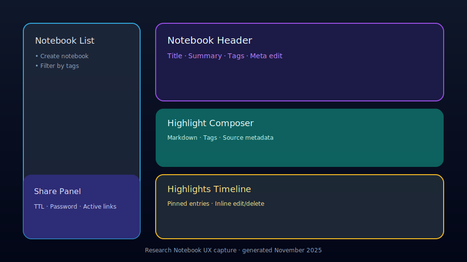

## Research Notebook UX Capture

This capture documents the MVP workspace delivered for the Research Notebook stream. Use it in release notes or runbooks when explaining the new flow.

### Key states

1. **Notebook list & creation (left rail)** – NotebookListPanel lets analysts create notebooks, scan recent ones, and filter by tags. Active selection highlights in cyan.
2. **Header/meta editor** – Shows title, summary, tags, and allows inline editing plus destructive delete.
3. **Highlight composer** – Markdown/preview tabs, tag chips, pinned toggle, and structured source metadata inputs (type/label/url/snippet/position).
4. **Entries timeline** – Sorted cards with inline edit/delete controls that rehydrate the composer for quick revisions.
5. **Share control** – TTL presets, optional password + hint, and copy/revoke controls for each share (with last-access + expiry context).
6. **Public viewer** – `/labs/notebook/share/[token]` renders a gradient view for recipients with password gating when required.

> Source: FastAPI `GET /api/v1/notebooks*` + Next.js `labs/notebook` client (November 2025 build).
