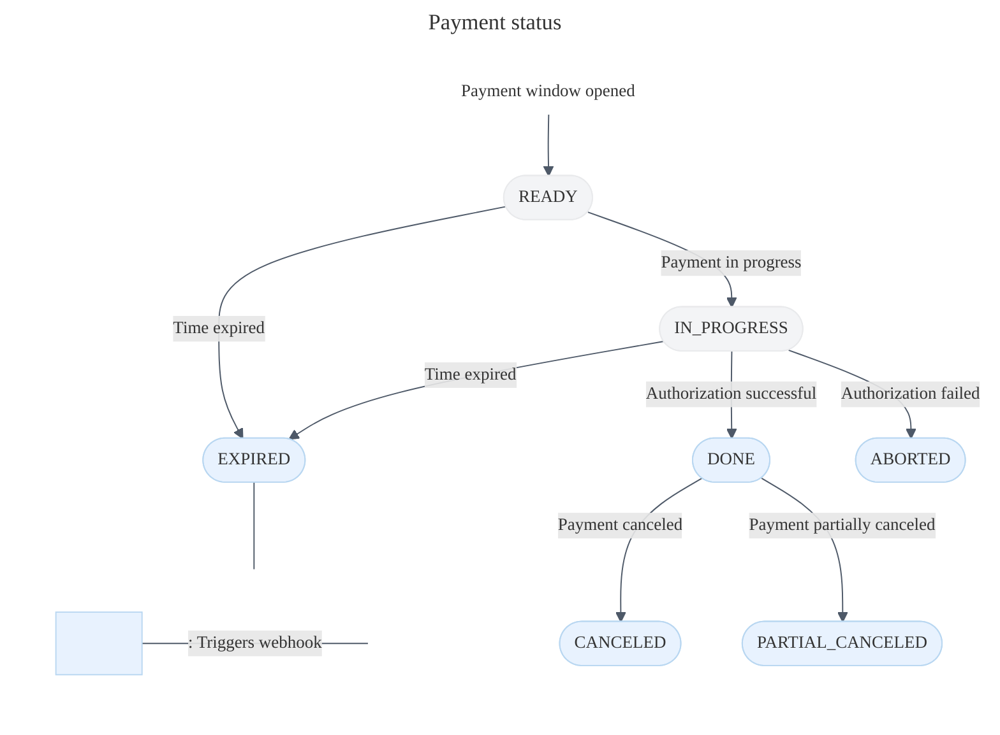
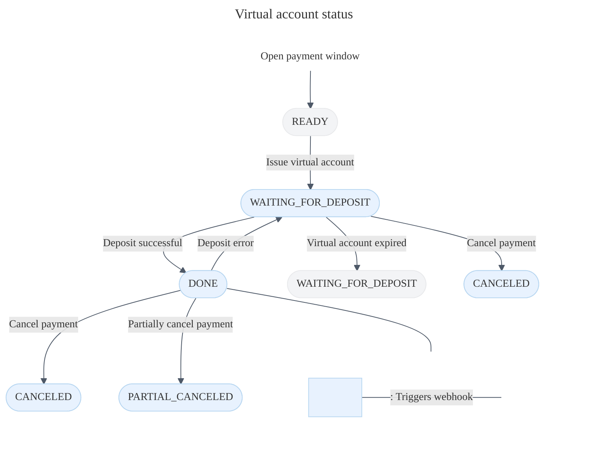
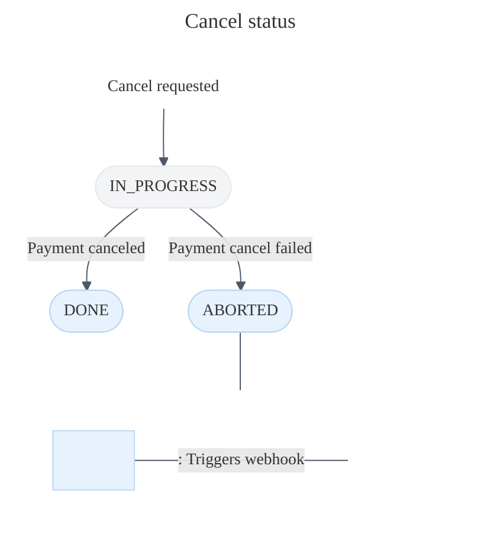
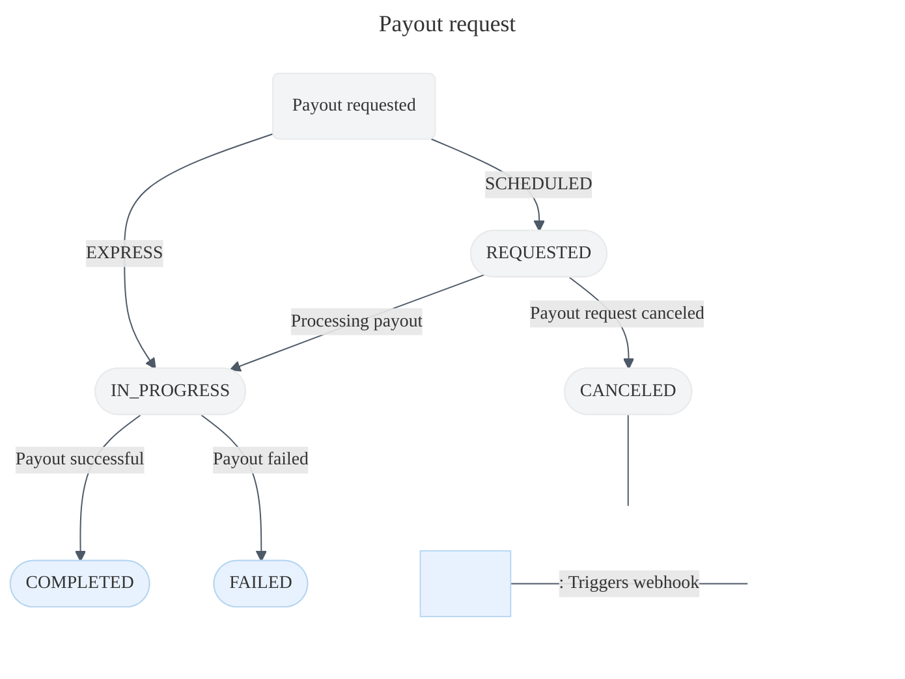
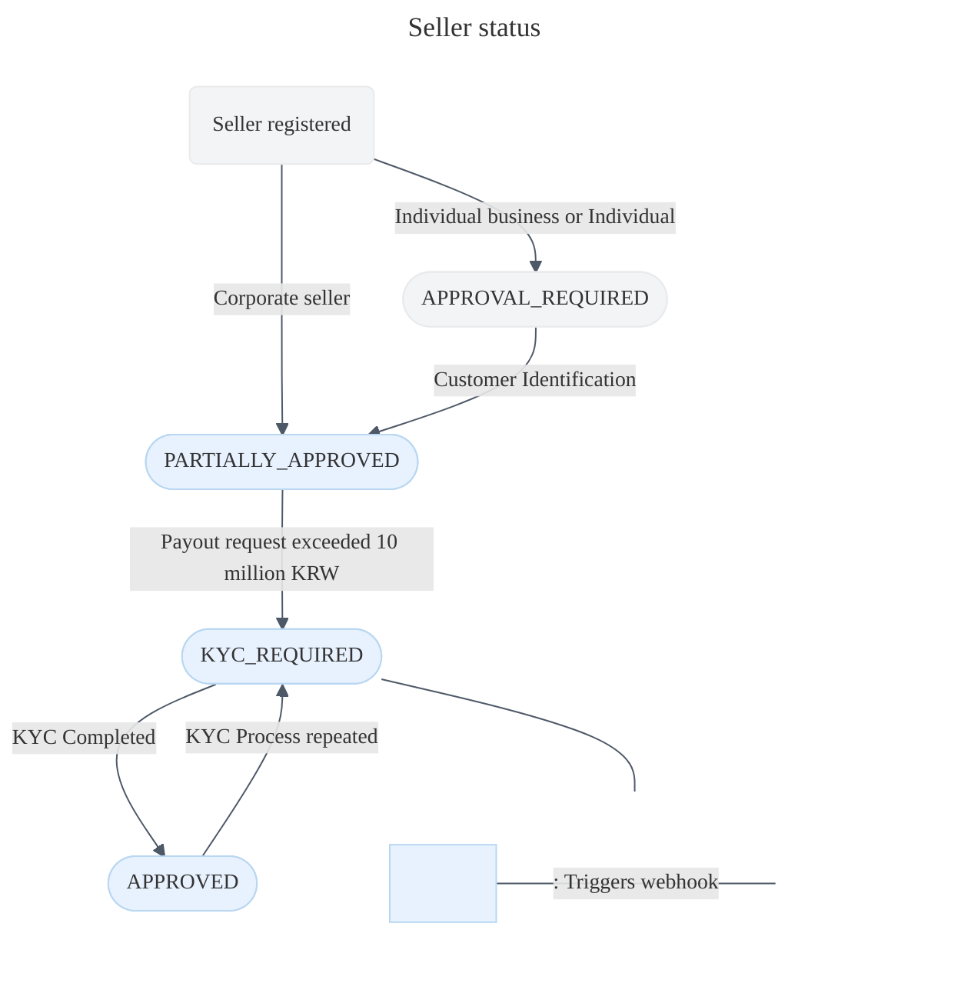

***

title: Integrate webhooks
description: Receive real-time notifications with webhooks. Get notified for payment updates, payouts, and BrandPay customer changes.
keyword: webhooks
-----------------

# Integrate webhooks

Webhooks allow you to get real-time notifications on payment events. When certain events occur, Toss Payments will send a webhook to your registered endpoint.

Webhooks are useful for when you want to trigger actions upon a certain event. For asynchronous events such as virtual account payments, webhook integrations are highly recommended because you want to provide goods or services to the customer only after they've deposited the right amount.

## 1. Explore webhooks events

Discover the payment events that trigger the below webhook events.


title: PAYMENT\_STATUS\_CHANGED


The `PAYMENT_STATUS_CHANGED` webhook event is triggered for one-time payments of all payment methods. A webhook is sent when the payment changes to any of the statuses highlighed in blue.

One important thing to note is that when the payment status is `READY`, the customer must authentication their payment method within 30 minutes. However once the authenticaiton is complete and the payment status is `IN_PROGRESS`, you have 10 minutes to authorize the payment before the data is lost.



```json title="Example" {10}
{
  "eventType": "PAYMENT_STATUS_CHANGED",
  "createdAt": "2022-01-01T00:00:00.000000",
  "data": {
    "mId": "tosspayments",
    "version": "2022-11-16",
    "lastTransactionKey": "B7103F204998813B889C77C043D09502",
    "paymentKey": "<UniqueId name='paymentKey.webhook' />",
    "orderId": "<UniqueId name='orderId.webhook' />",
    "status": "DONE",
    "requestedAt": "2022-08-05T12:56:00+09:00",
    "approvedAt": "2022-08-05T12:56:21+09:00",
    "useEscrow": false,
    "card": {
      "issuerCode": "61",
      "acquirerCode": "31",
      "number": "48902300****406*",
      "installmentPlanMonths": 0,
      "amount": 10000
      //...
    }
    //...
  }
}
```


name: eventType
required: true
type: string


Name of webhook event type.


name: createdAt
required: true
type: string


Time at which the event was created. Formatted in ISO 8601 `yyyy-MM-dd'T'HH:mm:ss.SSSSSS`.


name: data
required: true
type: object


[Payment object](/reference) associated with the event. See the `status` field.


title: DEPOSIT\_CALLBACK


The `DEPOSIT_CALLBACK` webhook event is only for virtual account payments. The webhook is triggered when the virtual account is issued, when the customer deposits into the virtual ccount, and when the payment is canceled.

In very few cases of network issues, the payment status can change from `DONE` back to `WAITING FOR DEPOSIT`. In these cases, inform the customer to make another deposit.

Note that the `PAYMENT_STATUS_CHANGED` webhook event also informs you of virutal account status updates. If you decide to register both the `PAYMENT_STATUS_CHANGED` webhook event and the `DEPOSIT_CALLBACK` event, you will get two events for the same payment.



```json title="Example" {4}
{
  "createdAt": "2022-01-01T00:00:00.000000",
  "secret": "<UniqueId name='secret.webhook' />",
  "status": "DONE",
  "transactionKey": "9FF15E1A29D0E77C218F57262BFA4986",
  "orderId": "<UniqueId name='orderId.webhook' />"
}
```


name: createdAt
required: true
type: string


Time at which the event was created. Formatted in ISO 8601 `yyyy-MM-dd'T'HH:mm:ss.SSSSSS`.


name: secret
required: true
type: string


Value used to validate the webhook event. This value should be the same as the value in the Payment object's `secret` field.


name: status
required: true
type: string


Status of payment


name: transactionKey
required: true
type: string


Key that identifies the virtual account transaction.


name: orderId
required: true
type: string


Order ID.


title: CANCEL\_STATUS\_CHANGED


The `CANCEL_STATUS_CHANGED` webhook works only for foreign payment methods in China and Southeast Asia, which are asynchronous.



```json title="Example" {2}
{
  "eventType": "CANCEL_STATUS_CHANGED",
  "createdAt": "2022-01-01T00:00:00.000000",
  "data": {
    //...
  }
}
```


name: eventType
type: string


Name of webhook event type.


name: createdAt
type: string


Time at which the event was created. Formatted in ISO 8601 `yyyy-MM-dd'T'HH:mm:ss.SSSSSS`.


name: data
type: object


[Cancel object](/reference#paymentdetaildto-cancels) associated with the event. See the `cancelStatus` field.


title: METHOD\_UPDATED


The `METHOD_UPDATED` webhook is for BrandPay integrations. Get notified when the cutomer registers, deletes, or renames a payment method.

```json title="Example" {7}
{
  "eventType": "METHOD_UPDATED",
  "createdAt": "2022-05-12T00:00:00.000000",
  "data": {
    "customerKey": "<UniqueId name='customerKey.webhook' />",
    "methodKey": "<UniqueId name='methodKey.webhook' />",
    "status": "ENABLE"
  }
}
```


name: eventType
type: string


Name of webhook event type.


name: createdAt
type: string


Time at which the event was created. Formatted in ISO 8601 `yyyy-MM-dd'T'HH:mm:ss.SSSSSS`.


name: data
type: object


Object with the following fields.

*   `customerKey`: Key that identifies the customer.
*   `methodKey`: Key that identifies the payment method.
*   `status`: Status of the payment method.
    *   `ENABLED`: Payment method is registered and ready to use.
    *   `DISABLED`: Payment method is deleted and no long availale for use.
    *   `ALIAS_UPDATED`: Alias of the payment method has changed.


title: CUSTOMER\_STATUS\_CHANGED


The `CUSTOMER_STATUS_CHANGED` webhook is for BrandPay integrations. Get notified when the cutomer registers or unregisters from BrandPay.

```json title="Example" {6}
{
  "eventType": "CUSTOMER_STATUS_CHANGED",
  "createdAt": "2022-01-01T00:00:00.000000",
  "data": {
    "customerKey": "<UniqueId name='customerKey.webhook' />",
    "status": "PASSWORD_CHANGED",
    "changedAt": "2022-01-01T00:00:00+09:00"
  }
}
```


name: eventType
required: true
type: number


The webhook event type.


name: createdAt
required: true
type: string


Time at which the event was created. Formatted in ISO 8601 `yyyy-MM-dd'T'HH:mm:ss.SSSSSS`.


name: data
required: true
type: object


The following three fields are returned.

*   `customerKey`: Key that identifies the custoemr.
*   `status`: Status of the customer.
    *   `CREATED`: Successfully registered to BrandPay.
    *   `REMOVED`: Unregistered from BrandPay.
    *   `PASSWORD_CHANGED`: Password changed.
    *   `ONE_TOUCH_ACTIVATED`: Activated one-touch payment.
    *   `ONE_TOUCH_DEACTIVATED`: Deactivated one-touch payment.
*   `changedAt`: Time at which the event occurred. Formatted in ISO 8601 format `yyyy-MM-dd'T'HH:mm:ss±hh:mm`.


title: payout.changed


Use this webhook to get notified on results of payout requests.



```json title="Example"
{
  "eventType": "payout.changed",
  "createdAt": "{yyyy-MM-dd'T'HH:mm:ss±hh:mm}",
  "version": "2022-11-16",
  "eventId": "{eventId}",
  "entityType": "payout",
  "entityBody": {
    "id": "FPA_12345",
    "refPayoutId": "my-payout-1",
    "destination": "seller-1",
    "scheduleType": "SCHEDULED",
    "payoutDate": "2024-08-08",
    "amount": {
      "currency": "KRW",
      "value": 5000.0
    },
    "transactionDescription": "8월대금지급",
    "requestedAt": "2024-08-07T22:00:00+09:00",
    "status": "COMPLETED",
    "error": null,
    "metadata": {
      "key1": "value1",
      "key2": "value2"
    }
  }
}

```


name: eventType
type: string


Name of webhook event type.


name: createdAt
type: string


Time at which the event was created. Formatted in ISO 8601 `yyyy-MM-dd'T'HH:mm:ss.SSSSSS`.


name: version
type: string


API Version of the object.


name: eventId
type: string


Unique value identifying the webhook


name: entityType
type: string


Type of the entity body.


name: entityBody
type: object


[Payout object](/reference/#payout-객체) associated with the event. Specific values in the object may vary according to the API version.


title: seller.changed


Use this wehook to receive updates on your registered sellers. The KYC process is repeated for sellers every 1 or 3 years, depending on the seller.



```json title="Example"
{
  "eventType": "seller.changed",
  "createdAt": "{yyyy-MM-dd'T'HH:mm:ss±hh:mm}",
  "version": "2022-11-16",
  "eventId": "{eventId}",
  "entityType": "seller",
  "entityBody": {
    "id": "seller-1",
    "refSellerId": "my-seller-1",
    "businessType": "INDIVIDUAL_BUSINESS",
    "company": {
      "name": "테스트 상호",
      "representativeName": "김토페",
      "businessRegistrationNumber": "1234567890",
      "email": "def@toss.im",
      "phone": "01087654321"
    },
    "individual": null,
    "account": {
      "bankCode": "092",
      "accountNumber": "123*****90123",
      "holderName": "아무개"
    },
    "status": "KYC_REQUIRED",
    "metadata": {
      "key1": "value1",
      "key2": "value2"
    }
  }
}

```


name: eventType
type: string


Name of webhook event type.


name: createdAt
type: string


Time at which the event was created. Formatted in ISO 8601 `yyyy-MM-dd'T'HH:mm:ss.SSSSSS`.


name: version
type: string


API Version of the object.


name: eventId
type: string


Unique value identifying the webhook


name: entityType
type: string


Type of the entity body.


name: entityBody
type: object


[Payout object](/reference/#payout-객체) associated with the event. Specific values in the object may vary according to the API version.

## 2. Register your endpoint

Log into the Developer Center and access the [Webhook menu](https://developers.tosspayments.com/my/webhooks). Click **Register Webhooks** and enter the name of the webhook and the endpoint where you'd like to receive the webhook. Check the webhook event you want to receive.

Once the endpoint is successfully registered, you should see it in the list of webhooks. Click on the name you entered to see more details.


title: Can I test the webhook in local environments?


Yes. Make sure to use a tool like ngrok to make sure Toss Payments can reach your local environment.


title: What format is the webhook event?


The webhook event is a JSON file that is delivered via HTTP POST. Ensure your server can handle JSON files. HTTPS connections are recommended over HTTP connections.

## 3. View webhook history

To view your webhook history, head over to the [Webhook menu](https://developers.tosspayments.com/my/webhooks) of the Developer Center. Click on the webhook name for details. This page cannot be translated we recommend using Google Translate. You will be able to see when the event was sent, and the status of the event. The status of the event is either Completed, Sending, or Failed.


### Webhook retry policies

When your server receives a webhook, it must return a 200 back to Toss Payments. If it doesn't, Toss Payments will assume your server did not properly receive the webhook and attempt to resend it.


Our system resends the webhook up to 7 times. Even if a certain attempt fails, the status of the webhook will be 'Sending' until the 7th retry. The interval at which the webhook is resent gradually increases as below.

If you're having trouble recieving the webhook, make sure you've allowed the access to [Toss Payments IP addresses](/guides/v2/get-started/environment#방화벽-설정하기).

| Number of Re-sending Attempt(s) | Time Intervals (minutes) |
| ------------------------------- | ------------------------ |
| 1                               | 1                        |
| 2                               | 4                        |
| 3                               | 16                       |
| 4                               | 64                       |
| 5                               | 256                      |
| 6                               | 1024                     |
| 7                               | 4096                     |
