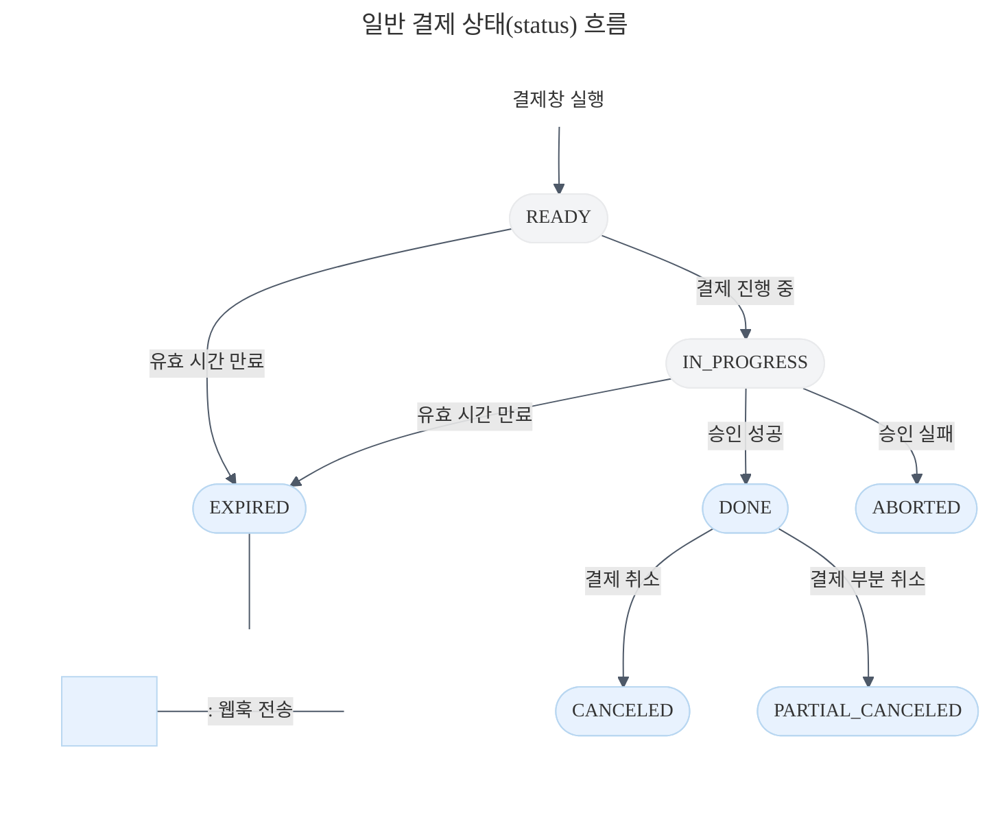
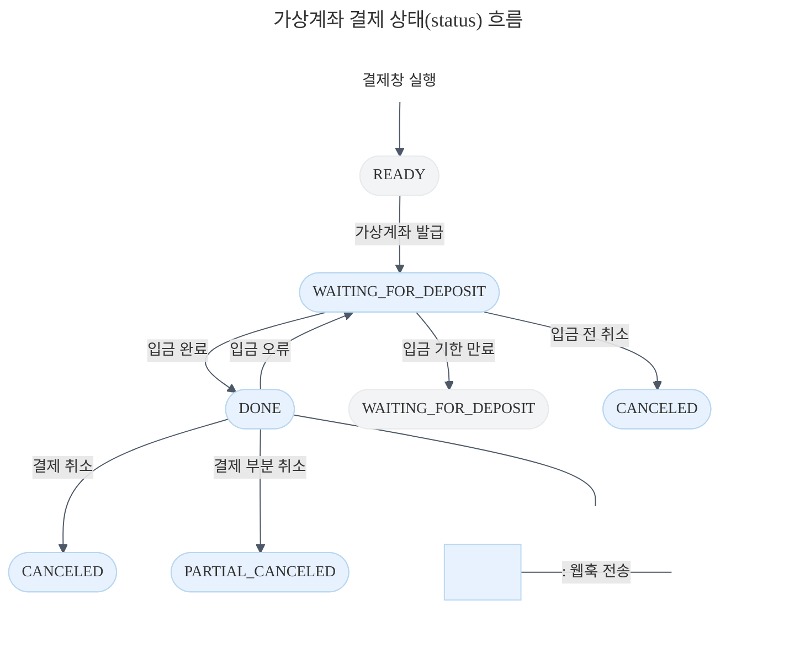
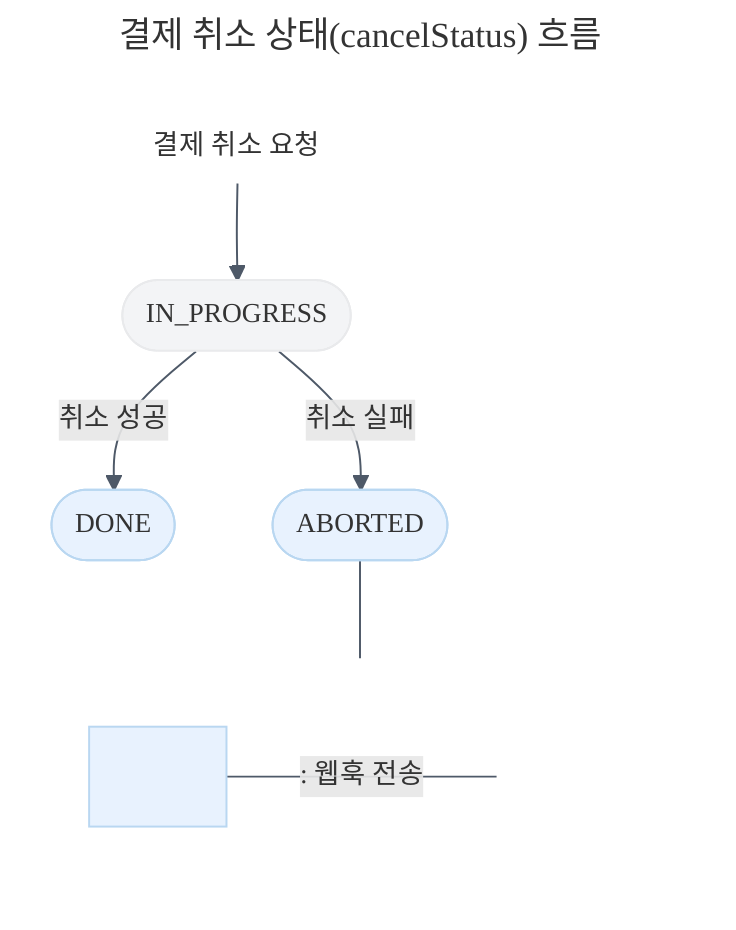
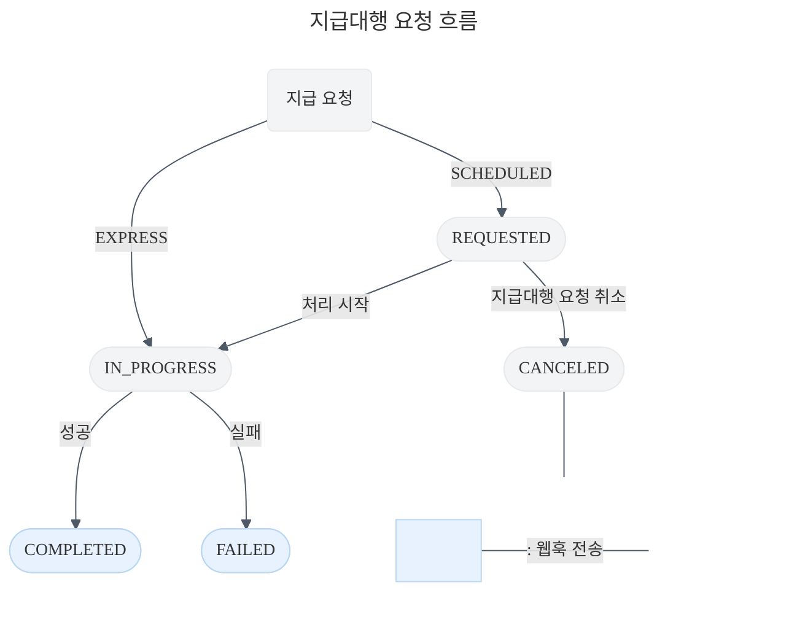
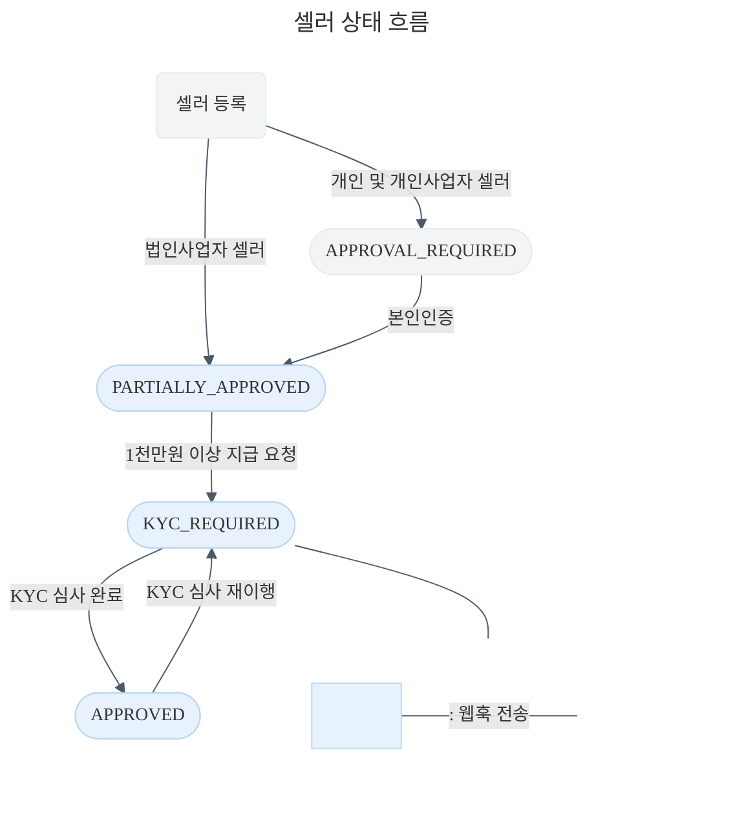

***

title: 웹훅 이벤트
description: 토스페이먼츠에서 제공하는 웹훅 이벤트 목록입니다.
keyword: 가상계좌 입금 알림, 웹훅, 콜백, 웹훅 이벤트, 알림, Webhook, PAYMENT\_STATUS\_CHANGED, DEPOSIT\_CALLBACK, PAYOUT\_STATUS\_CHANGED, METHOD\_UPDATED, CUSTOMER\_STATUS\_CHANGED, 입금 알림, 상태 변경, 입금 확인, 가상계좌 테스트, 입금 테스트, 입금 확인, 입금 기한 만료, 결제 만료, 결제 취소, 결제수단 변경, 회원 탈퇴
--------------------------------------------------------------------------------------------------------------------------------------------------------------------------------------------------------------------------------------------------------

# 웹훅 이벤트

토스페이먼츠에서 제공하는 [웹훅](/resources/glossary/webhook) 이벤트 목록입니다. 웹훅 연동 방법 및 재전송 정책은 [웹훅 연결하기](/guides/v2/webhook) 가이드를 참고해주세요.

## 웹훅 헤더

토스페이먼츠 웹훅은 다음과 같은 헤더가 있습니다.

```plain theme="grey"
'tosspayments-webhook-transmission-time: 2024-09-05T12:19:21+09:00'
'tosspayments-webhook-transmission-retried-count: 0'
'tosspayments-webhook-transmission-id: whtrans_a01j70335nkqqeg0zwzz2r4py9z'
'tosspayments-webhook-signature: v1:TvgZ2rrdPJvzhDBOej8UMybv0SHufgwdiv6+OzANJd4=,v1:/CSvw0DpqBaCVxUAEbzG2Q/7O9V6epYWyKzwavm4MU4='
```


name: tosspayments-webhook-transmission-time


웹훅이 발송된 시간입니다.


name: tosspayments-webhook-transmission-retried-count


웹훅이 재전송된 횟수입니다. 웹훅 재전송 정책을 확인하세요.


name: tosspayments-webhook-transmission-id


웹훅의 고유 식별자입니다.


name: tosspayments-webhook-signature


[`payout.changed`](#payoutchanged), [`seller.changed`](#sellerchanged) 웹훅 헤더에만 포함되는 웹훅 서명입니다. 토스페이먼츠가 보낸 웹훅인지 검증할 수 있는 값입니다. 검증하는 방법은 아래와 같습니다.

1.  `{WEBHOOK_PAYLOAD}:{tosspayments-webhook-transmission-time}` 값을 [보안 키](/guides/v2/payouts#보안-키)로 HMAC SHA-256 해싱하세요.&#x20;
2.  웹훅 헤더에서 `v1:` 뒤에 오는 2개의 값을 모두 base64로 디코딩하세요.&#x20;
3.  1번에서 해시값과 2번에서 디코딩한 값 중 **하나**가 일치하면 토스페이먼츠에서 보낸 올바른 웹훅이 맞습니다. 일치하지 않으면 토스페이먼츠에서 보낸 웹훅이 아니고 웹훅 데이터를 신뢰할 수 없습니다. 위에 있는 헤더를 예시로 들면, 아래 둘 중 하나의 값이 `true`이어야 합니다.

    ```plain theme="grey"
    HMACSHA256({WEBHOOK_PAYLOAD}:2024-09-05T12:19:21+09:00) == base64.decode(TvgZ2rrdPJvzhDBOej8UMybv0SHufgwdiv6+OzANJd4=)
    HMACSHA256({WEBHOOK_PAYLOAD}:2024-09-05T12:19:21+09:00) == base64.decode(/CSvw0DpqBaCVxUAEbzG2Q/7O9V6epYWyKzwavm4MU4=)
    ```

## 결제

### PAYMENT\_STATUS\_CHANGED

카드, 계좌이체, 휴대폰, 상품권 결제 상태를 알려주는 웹훅입니다. 웹훅이 발송되는 [결제 상태](/reference#paymentdetaildto-status)는 아래 그림에서 살펴보세요.



결제창이 유효한 30분 안에 구매자가 결제창에서 인증을 하지 않거나, 결제 인증이 유효한 10분 안에 상점에서 [결제 승인 API](/reference#결제-승인)를 호출하지 않으면 결제 상태가 `EXPIRED`로 변경됩니다.

구매자가 결제창을 닫으면 결제 상태가 바뀌지 않기 때문에 웹훅도 전송되지 않습니다.

[자동결제](/guides/v2/billing/integration)는 결제 요청에 이어서 승인이 되기 때문에 결제가 완료됐을 때 웹훅을 전송하지 않습니다.

#### 이벤트 본문

```json title="예시" {10}
{
  "eventType": "PAYMENT_STATUS_CHANGED",
  "createdAt": "2022-01-01T00:00:00.000000",
  "data": {
    "mId": "tosspayments",
    "version": "2022-11-16",
    "lastTransactionKey": "B7103F204998813B889C77C043D09502",
    "paymentKey": "<UniqueId name='paymentKey.webhook' />",
    "orderId": "<UniqueId name='orderId.webhook' />",
    "status": "DONE",
    "requestedAt": "2022-08-05T12:56:00+09:00",
    "approvedAt": "2022-08-05T12:56:21+09:00",
    "useEscrow": false,
    "card": {
      "issuerCode": "61",
      "acquirerCode": "31",
      "number": "48902300****406*",
      "installmentPlanMonths": 0,
      "amount": 10000
      //...
    }
    //...
  }
}
```


name: eventType
type: string


웹훅 이벤트 타입입니다.


name: createdAt
type: string


웹훅이 생성된 시간입니다. `yyyy-MM-dd'T'HH:mm:ss.SSSSSS` ISO 8601 형식입니다.


name: data
type: object


상태가 변경된 [Payment 객체](/reference#payment-객체)입니다.

### DEPOSIT\_CALLBACK

[가상계좌 결제](/resources/glossary/virtual-account) 상태를 알려주는 웹훅입니다. 웹훅이 발송되는 [결제 상태](/reference#paymentdetaildto-status)는 아래 그림에서 살펴보세요.



가상계좌 웹훅 연동 예제, 입금 테스트하는 방법 등 더 자세한 연동 방법은 [가상계좌 웹훅 연동 가이드](/blog/virtual-account-webhook)를 참고하세요.

구매자의 계좌 송금 한도가 초과되었거나 네트워크 이슈 등으로 입금 오류가 일어나면 결제 상태가 `DONE`에서 `WAITING_FOR_DEPOSIT`으로 변경됩니다. 구매자에게 다시 입금하도록 안내해야 합니다.

[버전 1.4](/resources/release-note#v14-)까지는 입금 오류가 일어나면 결제 상태가 `DONE`에서 `CANCELED`로 변경됩니다. 마찬가지로 구매자에게 다시 입금하도록 안내해야 합니다.

만약 [`PAYMENT_STATUS_CHANGED`](#payment_status_changed), [`DEPOSIT_CALLBACK`](#deposit_callback) 이벤트를 모두 등록했다면 가상계좌 상태가 변경될 때 웹훅이 두 번 전송됩니다.

#### 이벤트 본문

```json title="예시" {4}
{
  "createdAt": "2022-01-01T00:00:00.000000",
  "secret": "<UniqueId name='secret.webhook' />",
  "status": "DONE",
  "transactionKey": "9FF15E1A29D0E77C218F57262BFA4986",
  "orderId": "<UniqueId name='orderId.webhook' />"
}
```


name: createdAt
type: string


웹훅이 생성된 시간입니다. `yyyy-MM-dd'T'HH:mm:ss.SSSSSS` ISO 8601 형식입니다.


name: secret
type: string


가상계좌 웹훅 요청이 정상적인 요청인지 검증하는 값입니다. [결제 승인 API](/reference#결제-승인)의 응답으로 돌아온 `secret`과 같으면 정상적인 요청입니다.


name: status
type: string


결제 상태입니다.


name: transactionKey
type: string


상태가 변경된 가상계좌 거래를 특정하는 키입니다.


name: orderId
type: string


주문번호입니다. 자세한 결제 정보를 보고 싶다면 [`orderId`로 결제 조회](/reference#orderid로-결제-조회)를 하세요.

### CANCEL\_STATUS\_CHANGED

결제 취소 상태를 알려주는 웹훅입니다. 해외 간편결제가 취소되거나 취소가 실패했을 때 웹훅이 발송됩니다. 일반 국내 결제에는 웹훅이 발송되지 않습니다.



#### 이벤트 본문

```json title="예시" {5}
{
  "eventType": "CANCEL_STATUS_CHANGED",
  "createdAt": "2022-01-01T00:00:00.000000",
  "data": {
    //...
  }
}
```


name: eventType
type: string


웹훅 이벤트 타입입니다.


name: createdAt
type: string


웹훅이 생성된 시간입니다. `yyyy-MM-dd'T'HH:mm:ss.SSSSSS` ISO 8601 형식입니다.


name: data
type: object


상태가 변경된 [Cancel 객체](/reference#paymentdetaildto-cancels)입니다.

## 자동결제

### BILLING\_DELETED

#### 이벤트 본문

```json title="예시"
{
   "eventType": "BILLING_DELETED",
   "createdAt": "2024-12-01T00:00:00.000000",
   "data": {
      "billingKey": "wm60xF900HXZRzReBluSSgJriVX7d7rS0oyslw4zRwg",
      "reason": "삭제 API 요청" nullable
    }
}
```


name: eventType
type: string


웹훅 이벤트 타입입니다.


name: createdAt
type: string


웹훅이 생성된 시간입니다. `yyyy-MM-dd'T'HH:mm:ss.SSSSSS` ISO 8601 형식입니다.


name: billingKey
type: string


삭제된 빌링키입니다.


name: reason
type: string


삭제된 사유입니다.

## 브랜드페이

### METHOD\_UPDATED

브랜드페이 고객의 결제수단이 변경되면 웹훅이 전송됩니다.

#### 이벤트 본문

```json title="예시" {7}
{
  "eventType": "METHOD_UPDATED",
  "createdAt": "2022-05-12T00:00:00.000000",
  "data": {
    "customerKey": "<UniqueId name='customerKey.webhook' />",
    "methodKey": "<UniqueId name='methodKey.webhook' />",
    "status": "ENABLE"
  }
}
```


name: eventType
type: string


웹훅 이벤트 타입입니다.


name: createdAt
type: string


웹훅이 생성된 시간입니다. `yyyy-MM-dd'T'HH:mm:ss.SSSSSS` ISO 8601 형식입니다.


name: data
type: object


아래 세 가지 필드가 돌아옵니다.

*   `customerKey`: 상점에서 만든 고객의 고유 ID입니다.
*   `methodKey`: 결제수단을 특정하는 키입니다.
*   `status`: 결제수단의 상태입니다.
    *   `ENABLED`: 결제수단이 등록되어 사용할 수 있게 된 상태
    *   `DISABLED`: 결제수단이 삭제되어 사용할 수 없게 된 상태
    *   `ALIAS_UPDATED`: 등록되어 있는 결제수단의 별명이 변경된 상태

### CUSTOMER\_STATUS\_CHANGED

브랜드페이 고객의 상태가 변경되면 웹훅이 전송됩니다.

#### 이벤트 본문

```json title="예시" {6}
{
  "eventType": "CUSTOMER_STATUS_CHANGED",
  "createdAt": "2022-01-01T00:00:00.000000",
  "data": {
    "customerKey": "<UniqueId name='customerKey.webhook' />",
    "status": "PASSWORD_CHANGED",
    "changedAt": "2022-01-01T00:00:00+09:00"
  }
}
```


name: eventType
type: string


웹훅 이벤트 타입입니다.


name: createdAt
type: string


웹훅이 생성된 시간입니다. `yyyy-MM-dd'T'HH:mm:ss.SSSSSS` ISO 8601 형식입니다.


name: data
type: object


아래 세 가지 필드가 돌아옵니다.

*   `customerKey`: 상점에서 만든 고객의 고유 ID입니다.
*   `status`: 고객의 브랜드페이 사용 관련 상태입니다.
    *   `CREATED`: 간편결제에 가입한 상태
    *   `REMOVED`: 간편결제에 탈퇴한 상태
    *   `PASSWORD_CHANGED`: 비밀번호를 변경한 상태
    *   `ONE_TOUCH_ACTIVATED`: 원터치결제를 활성화한 상태
    *   `ONE_TOUCH_DEACTIVATED`: 원터치결제를 비활성화한 상태
*   `changedAt`: 변경이 일어난 시점입니다. `yyyy-MM-dd'T'HH:mm:ss±hh:mm` ISO 8601 형식입니다.

## 지급대행

### payout.changed

지급대행 요청 상태가 `COMPLETED`, `FAILED`로 바뀌면 웹훅이 전송됩니다.



#### 이벤트 본문

```json title="예시"
{
  "eventType": "payout.changed",
  "createdAt": "{yyyy-MM-dd'T'HH:mm:ss±hh:mm}",
  "version": "2022-11-16",
  "eventId": "{eventId}",
  "entityType": "payout",
  "entityBody": {
    "id": "FPA_12345",
    "refPayoutId": "my-payout-1",
    "destination": "seller-1",
    "scheduleType": "SCHEDULED",
    "payoutDate": "2024-08-08",
    "amount": {
      "currency": "KRW",
      "value": 5000.0
    },
    "transactionDescription": "8월대금지급",
    "requestedAt": "2024-08-07T22:00:00+09:00",
    "status": "COMPLETED",
    "error": null,
    "metadata": {
      "key1": "value1",
      "key2": "value2"
    }
  }
}

```


name: eventType
type: string


웹훅 이벤트 타입입니다. 지급대행 웹훅은 `payout.changed`입니다.


name: createdAt
type: string


웹훅이 생성된 시간입니다. `yyyy-MM-dd'T'HH:mm:ss±hh:mm` ISO 8601 형식입니다.


name: version
type: string


API 버전입니다. 토스페이먼츠의 [API 버전 정책](/reference/versioning) 및 [API 변경사항](/resources/release-note)을 확인해보세요.


name: eventId
type: string


웹훅의 고유 식별자입니다.


name: entityType
type: string


웹훅의 타입입니다.


name: entityBody
type: object


상태가 변경된 [Payout 객체](/reference/#payout-객체)입니다. 사용하는 API 버전에 따라 객체 필드가 다를 수 있습니다.

### seller.changed

셀러의 상태가 `PARTIALLY_APPROVED`, `KYC_REQUIRED`, `APPROVED`로 바뀌면 웹훅이 전송됩니다. KYC 심사를 마친 셀러는 1년 또는 3년에 다시 심사를 받아야 됩니다. 그럼 셀러의 상태는 다시 `KYC_REQUIRED`로 바뀝니다.



#### 이벤트 본문

```json
{
  "eventType": "seller.changed",
  "createdAt": "{yyyy-MM-dd'T'HH:mm:ss±hh:mm}",
  "version": "2022-11-16",
  "eventId": "{eventId}",
  "entityType": "seller",
  "entityBody": {
    "id": "seller-1",
    "refSellerId": "my-seller-1",
    "businessType": "INDIVIDUAL_BUSINESS",
    "company": {
      "name": "테스트 상호",
      "representativeName": "김토페",
      "businessRegistrationNumber": "1234567890",
      "email": "def@toss.im",
      "phone": "01087654321"
    },
    "individual": null,
    "account": {
      "bankCode": "092",
      "accountNumber": "123*****90123",
      "holderName": "아무개"
    },
    "status": "KYC_REQUIRED",
    "metadata": {
      "key1": "value1",
      "key2": "value2"
    }
  }
}

```


name: eventType
type: string


웹훅 이벤트 타입입니다. 지급대행 웹훅은 `seller.changed`입니다.


name: createdAt
type: string


웹훅이 생성된 시간입니다. `yyyy-MM-dd'T'HH:mm:ss±hh:mm` ISO 8601 형식입니다.


name: version
type: string


API 버전입니다. 토스페이먼츠의 [API 버전 정책](/reference/versioning) 및 [API 변경사항](/resources/release-note)을 확인해보세요.


name: eventId
type: string


웹훅의 고유 식별자입니다.


name: entityType
type: string


웹훅의 타입입니다.


name: entityBody
type: object


상태가 변경된 [Seller 객체](/reference/#seller-객체)입니다. 사용하는 API 버전에 따라 객체 필드가 다를 수 있습니다.
